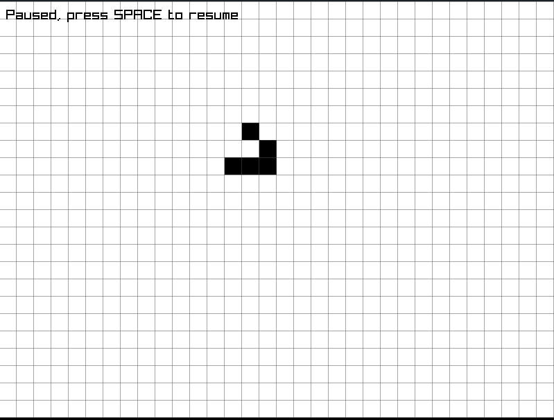

# Jogo da vida de Conway em Raylib

## Descrição 

Implementação do jogo da vida em C usando a biblioteca Raylib.



## Como compilar

Instale a biblioteca Raylib no seu sistema operacional e use make para compilar o código.

### Windows

```bash
make build target=windows
```

### Linux

```bash
make build
```

# Coisas a fazer:

- [ ] Fazer um sistema de chunks para ter um mundo efetivamente infinito
- [ ] Multi-threading
- [ ] Movimentos de câmera e zoom
- [ ] Uma melhor interface gráfica
